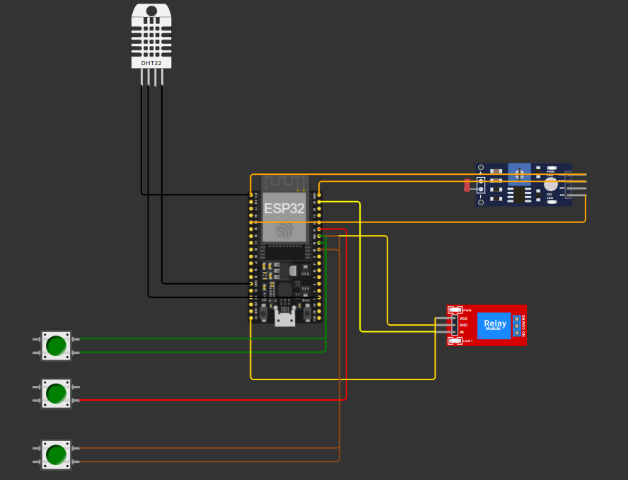

# FarmTech — Sistema Inteligente de Irrigação

## Sobre o projeto

Este projeto simula um sistema de irrigação inteligente utilizando ESP32 no Wokwi. O sistema monitora a umidade, simula a leitura do pH e permite indicar a presença de nutrientes por meio de botões.

## Componentes utilizados

- ESP32
- Sensor DHT22
- Sensor LDR
- 3 botões para representar Nitrogênio (N), Fósforo (P) e Potássio (K)
- Módulo relé para representar a bomba de água

## Funcionamento

O sistema utiliza o DHT22 para obter a umidade do ar como aproximação didática da umidade do solo. O LDR é utilizado para simular o pH, e os três botões representam a presença dos nutrientes N, P e K.

A bomba é ligada quando a umidade indicada fica abaixo de 40% e desligada quando atinge um valor igual ou superior a 40%.

## Simulação

**Link do Wokwi:** [(https://wokwi.com/projects/477431752532769793)]

## Tecnologias utilizadas

- C++
- ESP32
- Wokwi
- Arduino

## Imagem do circuito

